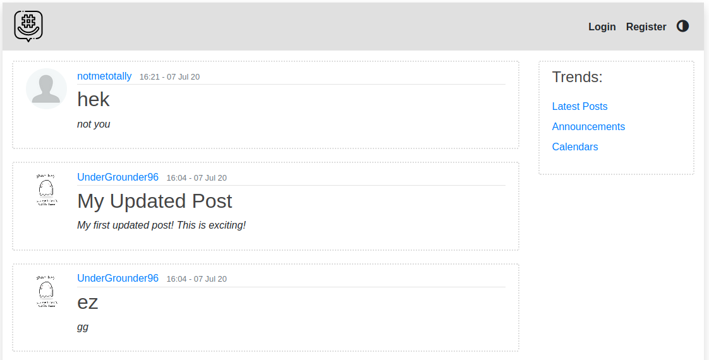

# Twitter_Django

Project created under Linux Ubuntu 64-bit using Python 3.8, pip 20.1.1 and Django 3.0.7

Currently live at: https://twitter-django-app.herokuapp.com/



## Tests

Perform system packages update and upgrade:<br />

```
$ sudo apt update && sudo apt upgrade
```

Installing Python 3:<br />

```
$ sudo apt install python3
[...]
$ python3 --version
[3.8.2]
```

Optionally, you could set Python 3.8 as default.<br />
**WARNING**: All following commands assume python 3.8 as default.<br />

```
$ sudo update-alternatives --install /usr/bin/python python /usr/bin/python3.8 1
```

Before installing pip, you may need to perform:<br />

```
$ sudo apt install python3-distutils libpq-dev python3-dev
```

Installing pip3 and then Django:<br />

```
$ sudo apt install python3-pip
[...]
$ [python -m] pip install -r requirements.txt
[...]
```

In order to call Pip as command itself:<br />

```
$ export PATH=$PATH:$HOME/.local/bin
```

One could test the entire project:<br />

```
$ python manage.py test
[...]
[OK]
[...]
```

## Deployment

Before starting. Please rename the file '.env.default' to '.env', and set in it your Secret credentials.<br />
Running the server:<br />

```
$ python manage.py migrate
$ python manage.py createsuperuser
$ python manage.py runserver
```

Open [localhost:8000](http://localhost:8000) in a browser.

## Versioning

Version 1.5 - Current version<br />
Version 5.0 (TBA) - Moderation algorithms

## Author

Lucio Afonso

## License

This project is licensed under the GPL License - see the LICENSE.md file for details

## Acknowledgments

Tutorials:

[Acumenus](https://stackoverflow.com/a/45474387/)<br />
[Corey Schafer](https://youtube.com/playlist?list=PL-osiE80TeTtoQCKZ03TU5fNfx2UY6U4p)<br />
[The Dumbfounds](https://youtube.com/playlist?list=PLbpAWbHbi5rMF2j5n6imm0enrSD9eQUaM)
